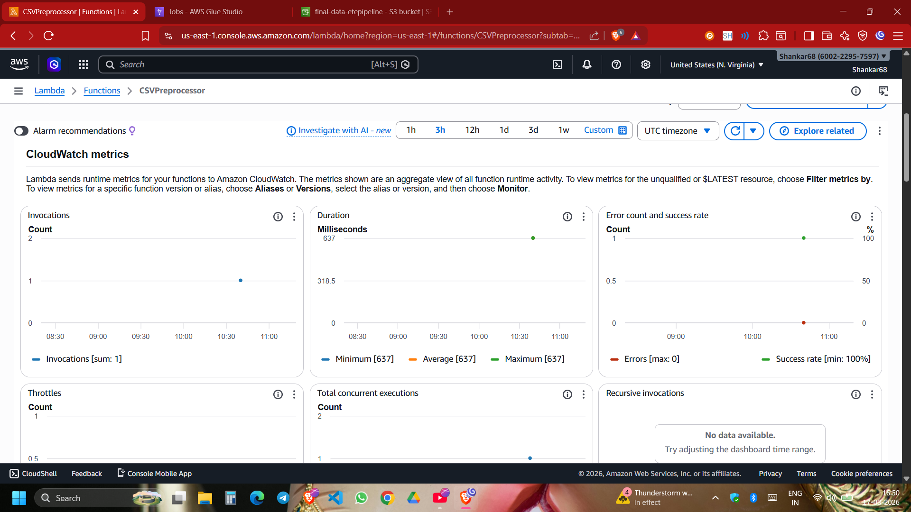
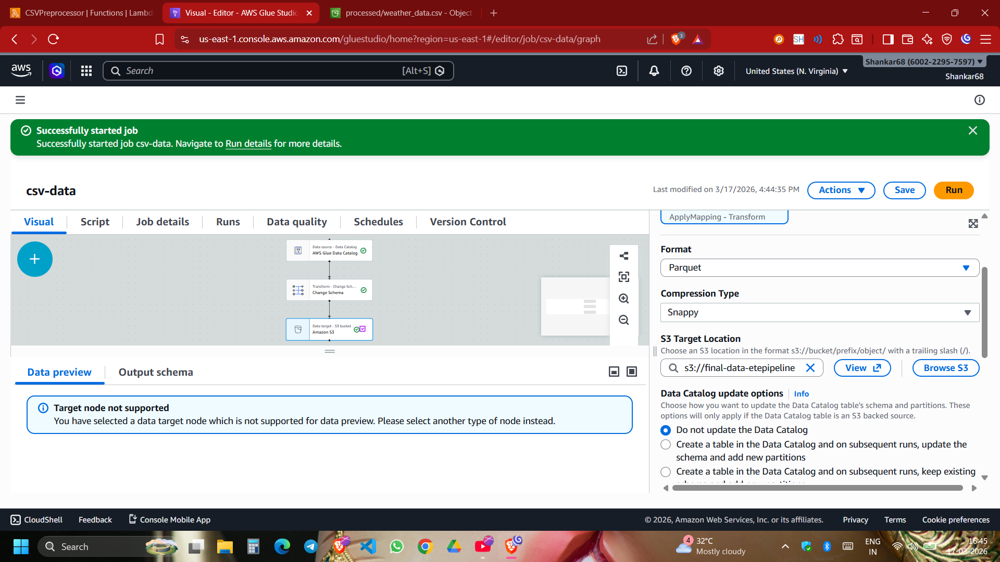
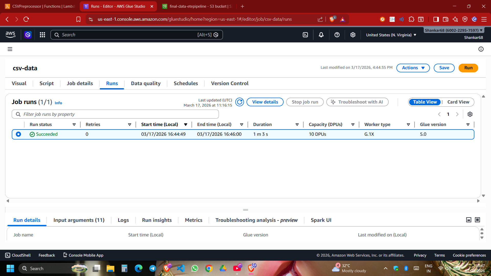
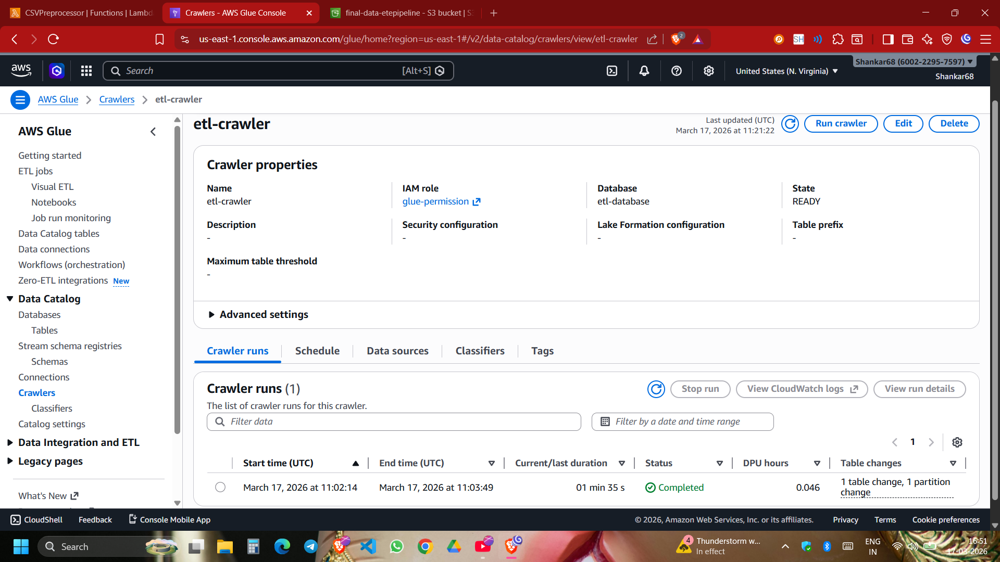
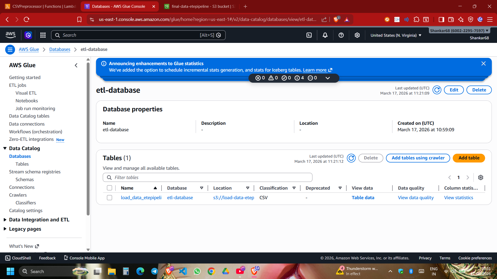
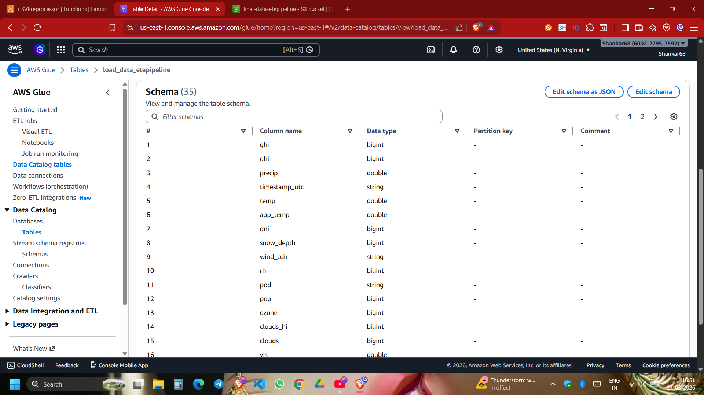
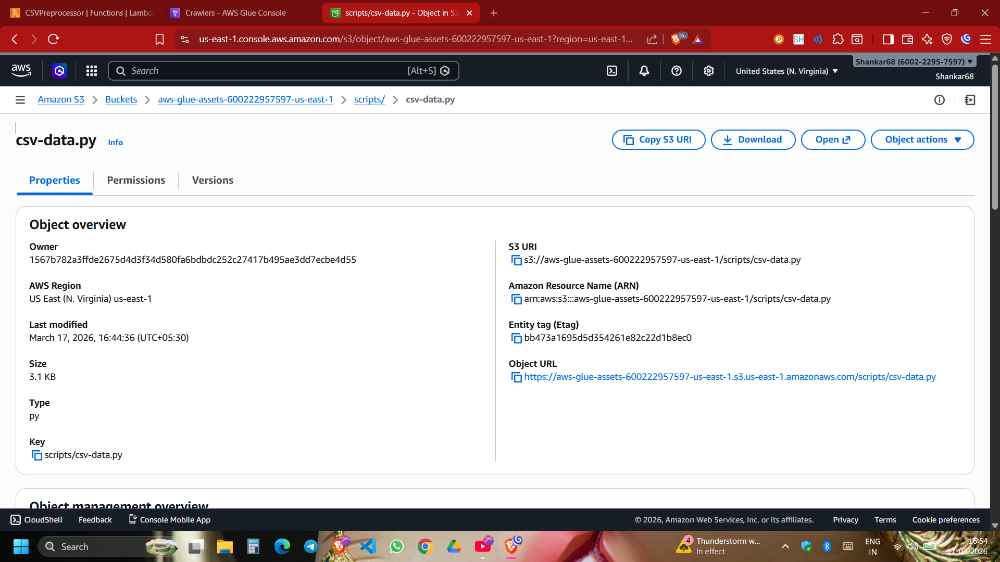
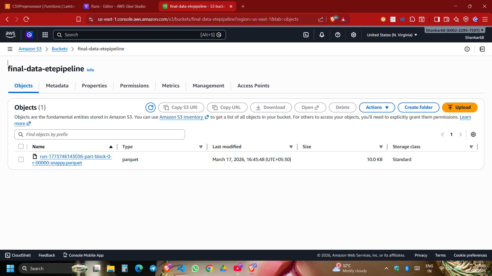

# AWS Weather Data ETL Pipeline

This project demonstrates a simple AWS data engineering pipeline built with Amazon S3, AWS Lambda, and AWS Glue. The workflow starts with a raw weather CSV file, preprocesses it with Lambda, catalogs it with a Glue crawler, and transforms it into Parquet format through a Glue ETL job.

## Project Overview

The repository is designed as a portfolio-ready example of an event-driven ETL pipeline on AWS.

Core services used:

- Amazon S3 for raw and processed data storage
- AWS Lambda for lightweight CSV preprocessing
- AWS Glue Crawler for schema discovery and Data Catalog creation
- AWS Glue ETL Job for transforming CSV data into Parquet

## Architecture

```text
Raw CSV file
   |
   v
Amazon S3 (raw/)
   |
   v
AWS Lambda trigger on object upload
   |
   v
Amazon S3 (processed/)
   |
   v
AWS Glue Crawler
   |
   v
AWS Glue Data Catalog
   |
   v
AWS Glue ETL Job
   |
   v
Amazon S3 (Parquet output)
```

## Repository Structure

```text
AWS-services/
|-- images/
|   |-- glue-crawler-run-history.png
|   |-- glue-data-catalog-table-schema.png
|   |-- glue-database-table-overview.png
|   |-- glue-job-run-success.png
|   |-- glue-job-visual-editor.png
|   |-- lambda-cloudwatch-metrics.png
|   |-- s3-glue-job-script-object.png
|   `-- s3-processed-parquet-output.png
|-- lambda/
|   `-- lambda_function.py
`-- weather_data.csv
```

## Workflow

### 1. Raw file upload to S3

The pipeline begins when a weather CSV file is uploaded to an S3 bucket under a raw-data prefix.

Example:

```text
s3://<raw-bucket>/raw/weather_data.csv
```

### 2. AWS Lambda preprocessing

The Lambda function in [`lambda/lambda_function.py`](lambda/lambda_function.py) is triggered by the S3 upload event.

What the function does:

- reads the uploaded CSV from S3
- keeps the header row
- filters out rows with missing values
- writes the cleaned result back to S3 under a `processed/` prefix

Important note:

- the processed bucket name in the function is still a placeholder: `<YOUR_PROCESSED_BUCKET_NAME>`
- before deploying, replace it with your actual target bucket name

### 3. AWS Glue Crawler

After the processed data is available in S3, an AWS Glue crawler scans the dataset and creates metadata in the Glue Data Catalog.

From the screenshots, the demo setup includes:

- crawler name: `etl-crawler`
- database name: `etl-database`
- discovered table: `load_data_etepipeline`

### 4. AWS Glue ETL Job

The Glue job reads cataloged CSV data, applies schema mapping, and writes the transformed output to Amazon S3 in Parquet format with Snappy compression.

This improves:

- storage efficiency
- analytics performance
- downstream compatibility with query engines and lakehouse workflows

### 5. Final output

The final output is stored in S3 as Parquet files, which are better suited than CSV for analytics and reporting workloads.

## Dataset Information

The sample file [`weather_data.csv`](weather_data.csv) is the input dataset used in this project.

Observed characteristics from the checked-in file:

- 40 data rows
- 34 columns
- weather-related features such as temperature, humidity, wind, cloud coverage, timestamps, and descriptive conditions

Example columns:

- `timestamp_utc`
- `temp`
- `app_temp`
- `rh`
- `wind_spd`
- `description(output)`

## Lambda Code Summary

The Lambda implementation uses:

- `boto3` to interact with Amazon S3
- `csv` and `io` to read and rewrite CSV content in memory

Current processing logic:

- extract bucket name and key from the S3 event
- download the uploaded object
- parse CSV rows
- remove rows containing missing fields
- upload the cleaned file to the processed bucket

This is a good starter pattern for event-driven preprocessing and can be extended with:

- validation rules
- schema checks
- logging improvements
- dead-letter handling
- environment variables for bucket names

## Screenshots

### Lambda Monitoring



### Glue Visual Job



### Glue Job Run Status



### Glue Crawler



### Glue Database and Table



### Glue Data Catalog Schema



### Glue Job Script in S3



### Final Parquet Output in S3



## How To Run This Project

1. Create an S3 bucket for raw input data.
2. Create another S3 bucket or prefix for processed output.
3. Deploy the Lambda function and configure an S3 event trigger for object creation.
4. Update the processed bucket name inside the Lambda code.
5. Upload the CSV file to the raw S3 location.
6. Create and run a Glue crawler on the processed data location.
7. Create a Glue ETL job to read from the cataloged table and write Parquet output to S3.
8. Verify the transformed output in the destination bucket.

## Skills Demonstrated

- Event-driven serverless processing
- S3 object-triggered Lambda workflows
- CSV preprocessing in Python
- Data cataloging with AWS Glue
- ETL pipeline orchestration concepts
- Converting raw CSV data into analytics-friendly Parquet output

## Suggested Improvements

- replace hardcoded bucket names with environment variables
- add IAM policy examples
- include Glue ETL script source in this repository
- add architecture diagram
- add Terraform or CloudFormation for reproducible deployment
- add Athena queries for analytics on the Parquet output

## Summary

This project shows a practical AWS ETL pipeline that combines S3, Lambda, and Glue into a simple but effective data processing workflow. It is a solid example of serverless preprocessing plus managed ETL and is suitable for showcasing cloud, data engineering, and AWS service integration skills on GitHub.
